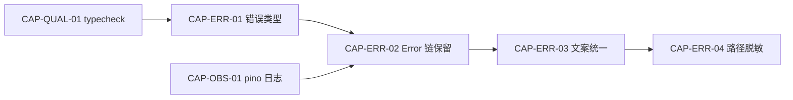

# Errors Spec (Delta)

## 前置依赖图



---

## CAP-ERR-01 错误类型体系

### 规格

**Given** `src/governance/errors.ts` 已存在基础 `DevBrainError`  
**When** 任意 adapter send 失败或内部错误时  
**Then** 抛出统一错误类型，继承链如下：

```typescript
export class DevBrainError extends Error {
  readonly code: string;
  constructor(message: string, opts?: { cause?: unknown; code?: string }) {
    super(message);
    this.name = this.constructor.name;
    this.code = opts?.code ?? this.constructor.name;
    if (opts?.cause !== undefined) {
      (this as any).cause = opts.cause;
    }
  }
}

export class AdapterSendError extends DevBrainError {}
export class TaskNotFoundError extends DevBrainError {}
export class DependencyCycleError extends DevBrainError {}
export class UnauthorizedSenderError extends DevBrainError {
  constructor(senderOpenId: string) {
    super(`sender ${senderOpenId} not in allowFrom`, { code: 'UNAUTHORIZED' });
  }
}
export class ConfigError extends DevBrainError {}
export class BridgeTimeoutError extends DevBrainError {}
export class LockConflictError extends DevBrainError {
  readonly requesterAgentId: string;
}
export class BridgeProtocolError extends DevBrainError {}
```

### 输入

| 参数 | 类型 | 说明 |
|------|------|------|
| `error` | `unknown` | 任意异常 |
| `sessionKey` | `string` | 会话标识 |

### 输出

| 类型 | 说明 |
|------|------|
| `throw DevBrainError` | 业务错误 |
| `Result<ok, error>` | adapter 返回值（不破坏现有契约） |

### 验收清单

- [ ] `pnpm typecheck` 通过
- [ ] `grep -r "extends DevBrainError" src/` 找到 8 个错误类
- [ ] 每个错误类含 JSDoc 注释
- [ ] L5-HARDEN-06 验证 5 个 review 发现 100% 命中

### 示例

```typescript
// 使用示例
catch (err: unknown) {
  if (err instanceof DevBrainError) throw err;
  throw new AdapterSendError('subtask failed', { cause: err });
}
```

---

## CAP-ERR-02 Error 链保留

### 规格

**Given** 7+ 处裸 `throw new Error(content)` 丢失 stack  
**When** 任意 `catch (error: unknown)` 时  
**Then** 统一走 `toErrorMessage(error)` 提取文案：

```typescript
// src/utils/errors.ts
export function toErrorMessage(error: unknown): string {
  if (error instanceof Error) return error.message;
  if (typeof error === 'string') return error;
  return JSON.stringify(error);
}

export function asBrainError(error: unknown): DevBrainError {
  if (error instanceof DevBrainError) return error;
  return new DevBrainError(toErrorMessage(error), { cause: error });
}
```

**And** `error.cause` 链保留原始 stack  
**And** adapter 边界保留 `Result<ok, output?, error?>`（向后兼容）

### 输入

| 参数 | 类型 | 说明 |
|------|------|------|
| `error` | `unknown` | 任意异常 |

### 输出

| 类型 | 说明 |
|------|------|
| `string` | 人类可读错误文案 |

### 验收清单

- [ ] `grep "catch (error: unknown)" src/**/*.ts` 全部走过 `toErrorMessage`
- [ ] `grep "instanceof Error" src/` 仅在 `toErrorMessage` 内出现
- [ ] L5-NEW-20 验证 `instanceof Error` 仅在 utils 内命中

### 依赖

| CAP | 说明 |
|-----|------|
| CAP-OBS-01 | pino 日志先行（logging error 时） |
| CAP-ERR-01 | DevBrainError 基类存在 |

---

## CAP-ERR-03 错误文案统一前缀

### 规格

**Given** 5+ 处错误出口文案不一致（`❌ 任务失败` / `⛔ 无权限` / `⚠️ 文件锁冲突`）  
**When** 任意 `DevBrainError` 展示时  
**Then** 统一格式 `[{emoji}] [{code}] {message}`，规则如下：

| 错误类型 | emoji | code 示例 |
|---------|-------|-----------|
| 鉴权 | ⛔ | `UnauthorizedSenderError` |
| 配置 | 🔑 | `ConfigError` |
| 未找到 | 🔍 | `TaskNotFoundError` |
| 冲突 | 🔒 | `LockConflictError` |
| 超时 | ⏱ | `BridgeTimeoutError` |
| 协议错误 | 🛑 | `BridgeProtocolError` |
| 通用失败 | ❌ | `AdapterSendError` |

**And** 格式化函数签名：

```typescript
// src/utils/format-error.ts
type Audience = 'feishu' | 'cli' | 'log';
export function formatError(err: DevBrainError, audience: Audience): string;
```

### 输入

| 参数 | 类型 | 说明 |
|------|------|------|
| `err` | `DevBrainError` | 错误实例 |
| `audience` | `Audience` | 展示终端 |

### 输出

| audience | 格式 |
|----------|------|
| `feishu` | ⛔ [UNAUTHORIZED] sender not allowed |
| `cli` | ⛔ [UNAUTHORIZED] sender not allowed. Next: /verify |
| `log` | level=error code=UNAUTHORIZED message="sender not allowed" |

### 验收清单

- [ ] `grep "❌\|\|⛔\|\|⚠️" src/` 统一走 `formatError`
- [ ] L5-NEW-21 验证 7 类 error 三处文案一致

### 依赖

| CAP | 说明 |
|-----|------|
| CAP-ERR-01 | 错误类型存在 |

---

## CAP-ERR-04 路径脱敏

### 规格

**Given** 错误信息含 `socketPath`（`/Users/fukai/.cc-connect/run/api.sock`）或绝对路径  
**When** 输出到飞书/CLI 时  
**Then** 自动 redact：

```typescript
// src/utils/redact.ts
const REDACT_PATTERNS = [
  [/\/Users\/[^/]+/g, '/Users/<user>'],
  [/\$HOME/g, '~'],
  [/\/home\/[^/]+/g, '/home/<user>'],
];

export function redact(error: unknown): unknown {
  const str = JSON.stringify(error);
  return REDACT_PATTERNS.reduce(
    (s, [pattern, replacement]) => s.replace(pattern, replacement),
    str
  );
}
```

**And** 原始路径仅进 `logger.error`（不暴露给用户）

### 输入

| 参数 | 类型 | 说明 |
|------|------|------|
| `error` | `unknown` | 含路径的错误对象 |

### 输出

| 目标 | 内容 |
|------|------|
| 飞书卡片 | redact 后的路径 |
| CLI stderr | redact 后的路径 |
| 日志 | 原始路径 |

### 验收清单

- [ ] `grep "socketPath\|\$HOME\|\/Users\/" src/` 仅在 logger.error 内
- [ ] L5-NEW-22 覆盖路径脱敏测试

---

## L5 锚点索引

| L5 ID | 验证项 | 关联 CAP |
|-------|--------|---------|
| L5-HARDEN-05 | 端到端错误处理 | ERR-01~04 |
| L5-HARDEN-12 | state 恢复含错误类 | ERR-01 |
| L5-NEW-20 | `instanceof Error` 仅在 utils | ERR-02 |
| L5-NEW-21 | 7 类错误三处文案一致 | ERR-03 |
| L5-NEW-22 | 路径脱敏覆盖 | ERR-04 |
