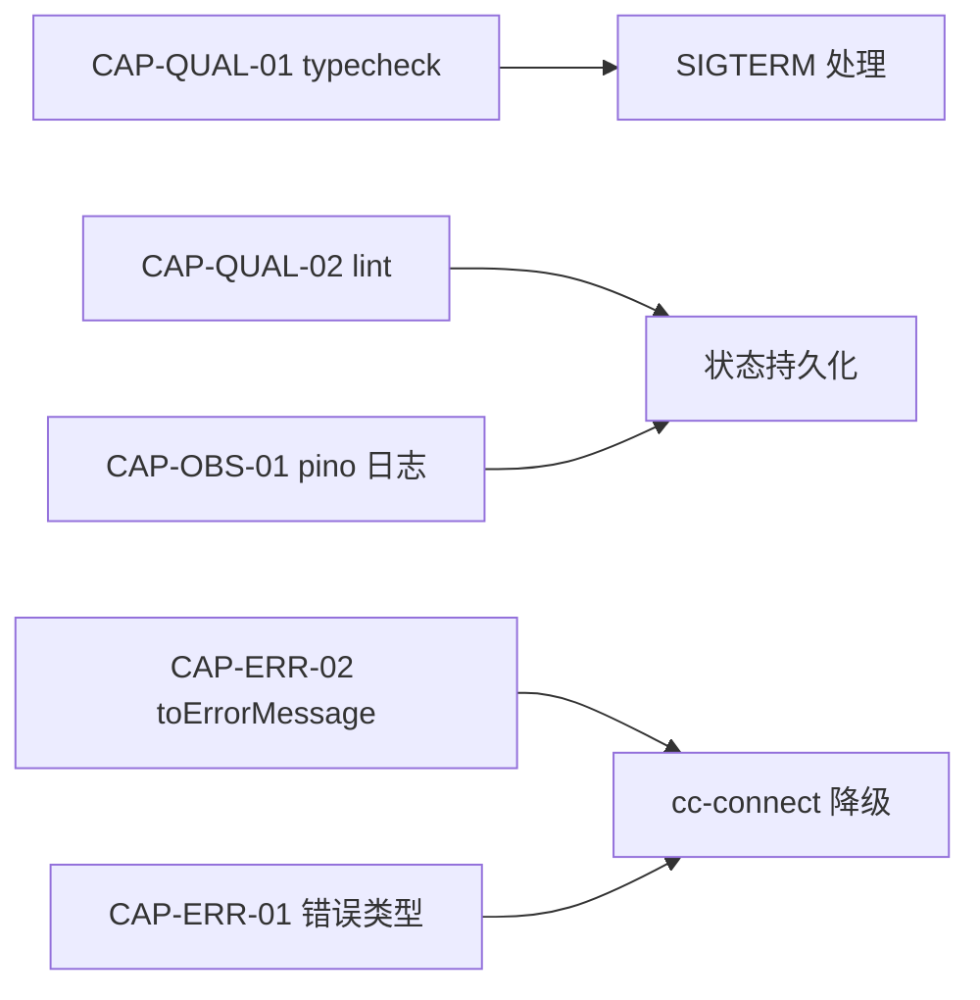

# Reliability Spec

## 前置依赖图



---

## CAP-REL-01 SIGTERM 优雅退出

### 规格

**Given** `runFeishuEventLoop` 当前返回 `new Promise<never>`  
**When** 收到 `SIGTERM` / `SIGINT`  
**Then** 执行优雅退出序列：

```typescript
process.on('SIGTERM', async () => {
  await child.kill('SIGTERM');
  rl.close();
  await Promise.race([
    brain.approveAndExecute(), // 等 inflight
    new Promise(r => setTimeout(r, 5000) // 5s 超时兜底
  ]);
  process.exit(0);
});
```

**And** 验证标准：
- [ ] SIGTERM 后 5s 内进程退出
- [ ] lark-cli 子进程 PID 不残留
- [ ] UDS fd 全部释放
- [ ] L5-HARDEN-07 验证

### 输入

| 参数 | 类型 | 说明 |
|------|------|------|
| — | — | 依赖 `runFeishuEventLoop` 入口 |

### 输出

| 参数 | 类型 | 说明 |
|------|------|------|
| `process.exit(0)` | exit code | 正常退出 |
| `process.exit(1)` | exit code | 异常退出 |

### 关联

| CAP | 说明 |
|-----|------|
| CAP-REL-01 | 本 CAP |
| CAP-QUAL-01 | typecheck 先修 |
| CAP-OBS-01 | pino 日志先行 |
| L5-HARDEN-07 | 验收 |

---

## CAP-REL-02 状态持久化

### 规格

**Given** `BrainEngine.pendingByChat` / `completed` 全内存  
**When** 整改后  
**Then** 持久化到 `~/.dev-brain/state.json`：

```typescript
// 写入策略
async function saveState(state: BrainState) {
  const tmp = statePath + '.tmp';
  await writeFile(tmp, JSON.stringify(state));
  await fsync(tmp); // 强制落盘
  await rename(tmp, statePath); // atomic
}
```

**And** debounce 5s 防抖动  
**And** `schemaVersion !== 1` 拒绝启动并报错

### 输入

| 参数 | 类型 | 说明 |
|------|------|------|
| `BrainState.pendingByChat` | `Map<ChatId, Plan>` | 待审批计划 |
| `BrainState.completed` | `Map<TaskId, Plan>` | 已完成计划 |

### 输出

| 参数 | 类型 | 说明 |
|------|------|------|
| `~/.dev-brain/state.json` | 文件 | 持久化状态 |
| `schemaVersion` | `number` | 版本号（当前 1） |

### 验收清单

- [ ] `grep -r "process.exit" src/` 仅在 `runFeishuEventLoop` 内
- [ ] atomic write 验证：模拟写失败不污染原文件
- [ ] L5-HARDEN-12 重启恢复
- [ ] `DEV_BRAIN_STATE_DIR` 可配置

### 关联

| CAP | 说明 |
|-----|------|
| CAP-REL-02 | 本 CAP |
| CAP-OBS-01 | pino 日志先行 |
| L5-HARDEN-12 | daemon 重启恢复 |

---

## CAP-REL-03 跨进程文件锁

### 规格

**Given** 当前 `FileLockManager` 内存 Map  
**When** 启动 `--multi-instance` flag  
**Then** 引入 `proper-lockfile`：

```typescript
// 锁目录 ~/.dev-brain/locks/
// 锁名格式 dev-brain:file-lock:<absPath>
// 默认单实例走内存（保留 P99 性能）
```

**And** 锁粒度：`dev-brain:lock:<taskId>:<filePath>`

### 输入

| 参数 | 类型 | 说明 |
|------|------|------|
| `absPath` | `string` | 锁路径 |
| `agentId` | `string` | 持锁方 |

### 输出

| 参数 | 类型 | 说明 |
|------|------|------|
| `LockHandle` | `object` | 锁句柄 |

### 验收清单

- [ ] `ls ~/.dev-brain/locks/` 锁文件存在
- [ ] 多实例互斥验证 L5-HARDEN-08
- [ ] flock 不破坏单实例性能

### 关联

| CAP | 说明 |
|-----|------|
| CAP-REL-03 | 本 CAP |

---

## CAP-REL-04 messageId 去重

### 规格

**Given** 飞书 event 重复投递  
**When** `messageId` 已收到  
**Then** 5 分钟滑动窗口去重：

```typescript
const seen = new Map<string, number>(); // messageId → expiryTs

function isDuplicate(messageId: string): boolean {
  const now = Date.now();
  for (const [id, ts] of seen) {
    if (now - ts > 5 * 60 * 1000) seen.delete(id); // 过期清理
  }
  if (seen.has(messageId)) return true;
  seen.set(messageId, Date.now());
  return false;
}
```

### 验收清单

- [ ] 100k 消息注入 pending 不超限
- [ ] `DEV_BRAIN_MESSAGE_DEDUP_WINDOW` 可配置

---

## L5 锚点

| L5 ID | 验证项 | CAP |
|-------|--------|-----|
| L5-HARDEN-07 | SIGTERM 5s 内退出 | CAP-REL-01 |
| L5-HARDEN-08 | 多实例互斥 | CAP-REL-03 |
| L5-HARDEN-09 | 100k 消息去重 | CAP-REL-04 |
| L5-HARDEN-12 | 重启恢复 | CAP-REL-02 |
| L5-NEW-16 | cc-connect 挂降级 | CAP-REL-07 |
| L5-NEW-17 | 4KB 上游限 | CAP-REL-08 |
| L5-NEW-18 | schema 版本检查 | CAP-REL-11 |
